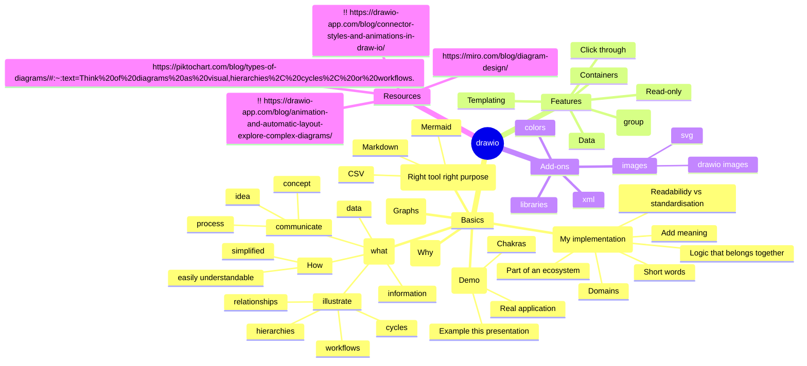

```mermaid
mindmap
  root((drawio))
    Basics
        (My implementation)
            Domains
            Logic that belongs together
            Add meaning
            Short words
            Readabilidy vs standardisation
            Part of an ecosystem
        (Why)
 
        (what)
                data  
                information 
            communicate 
                concept 
                idea 
                process 
            How
                simplified
                easily understandable
            illustrate 
                relationships
                hierarchies
                cycles
                workflows      
        (Graphs)
        (Right tool right purpose)
            Mermaid
            CSV
            Markdown
        (Demo)
            Real application
            Chakras    
            Example this presentation


    Features
        Templating
        Containers
        Parent-child (group)
        Click through
        Data
        Read-only 
    Add-ons
        colors
        libraries
        images
           svg
           drawio images
        xml   
    Resources
        https://piktochart.com/blog/types-of-diagrams/#:~:text=Think%20of%20diagrams%20as%20visual,hierarchies%2C%20cycles%2C%20or%20workflows.
        https://miro.com/blog/diagram-design/
        !! https://drawio-app.com/blog/animation-and-automatic-layout-explore-complex-diagrams/
        !! https://drawio-app.com/blog/connector-styles-and-animations-in-draw-io/

```

