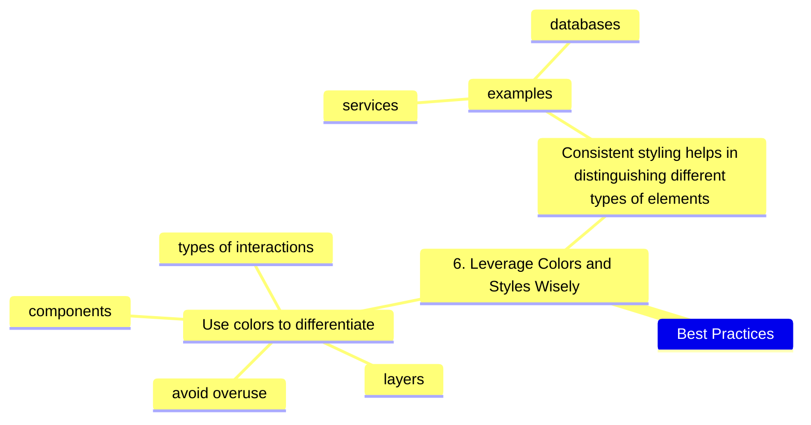

---
tags:
  - IDEA
---

####   Use color coding - leverage colors and styles wisely

- ![[IDEA-Limit-Text-Add-A-Legend]]
- ![[IDEA-Color-differentiate]]
- ![[IDEA-Color-Show-Meaning]]
- ![[THEME-contrast]]

