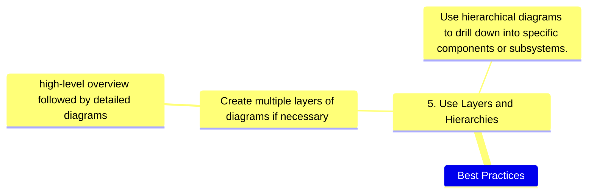

---
Tags:
  - IDEA
---

# Best practices: create multiple layers of diagrams if necessary:  high-level overview followed by detailed diagrams 

```mermaid
mindmap
    Best Practices
       5. Use Layers and Hierarchies
           Create multiple layers of diagrams if necessary 
               high-level overview followed by detailed diagrams
           Use hierarchical diagrams to drill down into specific components or subsystems.

```              