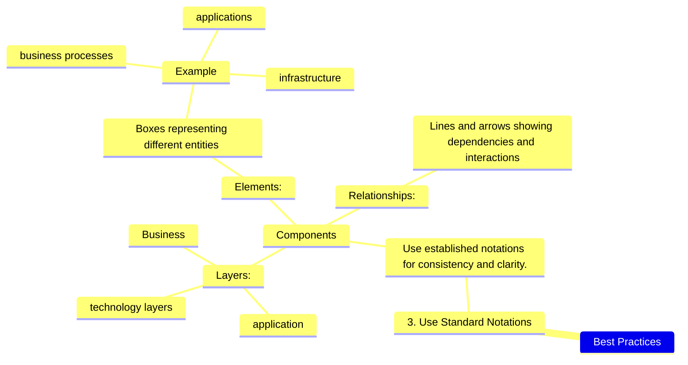

---
Tags:
  - THEME
---

# ArchiMate is a modeling language for enterprise architecture 

- ![[IDEA-ArchiMate-components-layers]]
- ![[IDEA-ArchiMate-components-elements]]
- ![[IDEA-ArchiMate-components-relations]]

