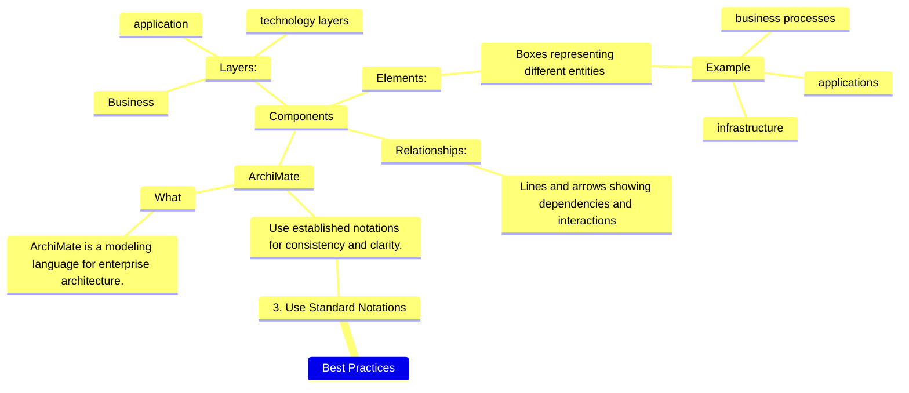

---
Tags:
  - THEME
---

# ArchiMate

- ![[IDEA-ArchiMate-what-modeling-language-for-enterprise-architecture]]
- ![[IDEA-ArchiMate-what-modeling-language-for-enterprise-architecture]]

```mermaid
mindmap
    Best Practices
         3. Use Standard Notations
           Use established notations for consistency and clarity.

               ArchiMate
                  What
                    ArchiMate is a modeling language for enterprise architecture.
                  Components  
                    Layers: 
                       Business
                       application
                       technology layers
                    Elements: 
                        Boxes representing different entities 
                           Example 
                              business processes 
                              applications 
                              infrastructure
                    Relationships: 
                       Lines and arrows showing dependencies and interactions
```              