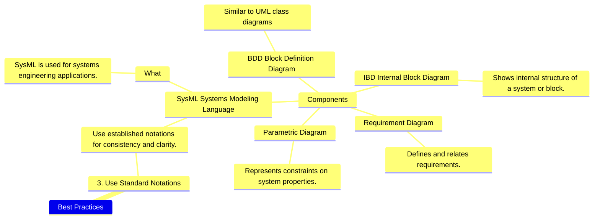

---
Tags:
  - THEME
---

# Best practices

- 

```mermaid
mindmap
    Best Practices
         3. Use Standard Notations
           Use established notations for consistency and clarity.

               SysML Systems Modeling Language
                  What
                    SysML is used for systems engineering applications.
                  Components  
                    BDD Block Definition Diagram
                        Similar to UML class diagrams
                    IBD Internal Block Diagram 
                        Shows internal structure of a system or block.
                    Requirement Diagram
                        Defines and relates requirements.
                    Parametric Diagram
                        Represents constraints on system properties.
```              