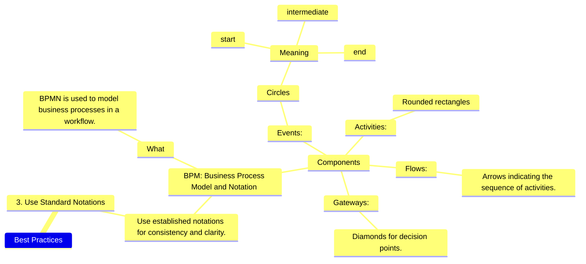

---
Tags:
  - THEME
---

# BPM: Business Process Model

- 

```mermaid
mindmap
    Best Practices
         3. Use Standard Notations
           Use established notations for consistency and clarity.
               BPM: Business Process Model and Notation 
                  What
                     BPMN is used to model business processes in a workflow.
                  Components
                     Events: 
                        Circles 
                           Meaning
                              start
                              intermediate
                              end
                     Activities: 
                          Rounded rectangles
                     Gateways: 
                          Diamonds for decision points.
                     Flows: 
                          Arrows indicating the sequence of activities.
```              