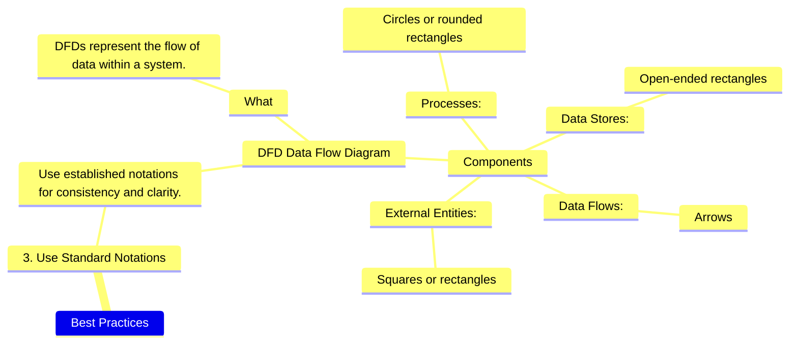

---
Tags:
  - THEME
---

# DFD Data Flow Diagram 

- 

```mermaid
mindmap
    Best Practices
         3. Use Standard Notations
           Use established notations for consistency and clarity.

               DFD Data Flow Diagram 
                  What
                     DFDs represent the flow of data within a system.
                  Components   
                     Processes: 
                         Circles or rounded rectangles
                     Data Stores: 
                         Open-ended rectangles
                     Data Flows: 
                         Arrows
                     External Entities: 
                         Squares or rectangles

```              