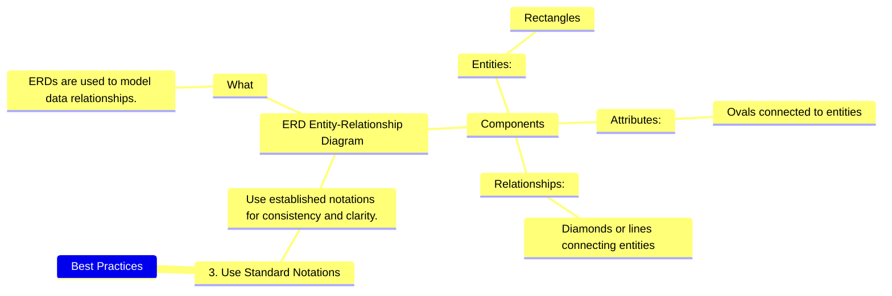

---
Tags:
  - THEME
---

# ERD Entity-Relationship Diagram 

- 

```mermaid
mindmap
    Best Practices
         3. Use Standard Notations
           Use established notations for consistency and clarity.

               ERD Entity-Relationship Diagram 
                  What
                    ERDs are used to model data relationships.
                  Components
                      Entities: 
                          Rectangles
                      Attributes: 
                          Ovals connected to entities
                      Relationships: 
                           Diamonds or lines connecting entities

```              