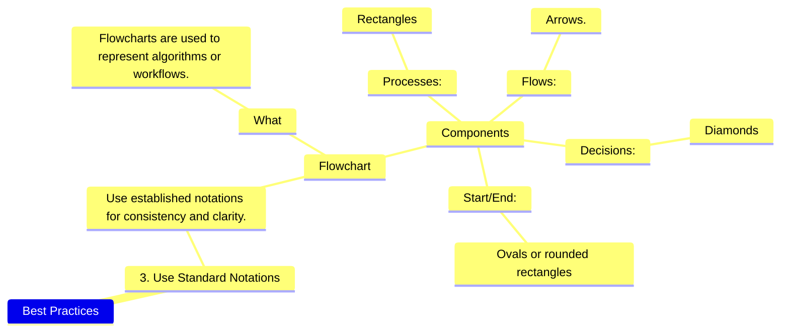

---
Tags:
  - THEME
---

# Best practices

- 

```mermaid
mindmap
    Best Practices
         3. Use Standard Notations
           Use established notations for consistency and clarity.

               Flowchart
                  What
                     Flowcharts are used to represent algorithms or workflows.
                  Components  
                     Processes: 
                        Rectangles
                     Decisions: 
                         Diamonds
                     Start/End: 
                         Ovals or rounded rectangles
                     Flows: 
                       Arrows.

```              