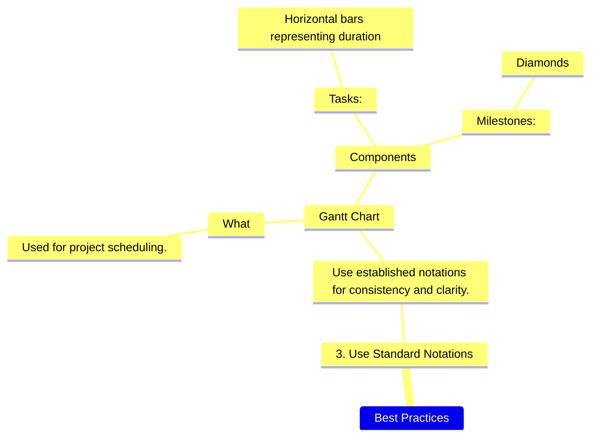

---
Tags:
  - THEME
---

# Best practices

- 

```mermaid
mindmap
    Best Practices
         3. Use Standard Notations
           Use established notations for consistency and clarity.


               Gantt Chart
                  What
                    Used for project scheduling.
                  Components  
                    Tasks: 
                       Horizontal bars representing duration
                    Milestones: 
                       Diamonds

```              