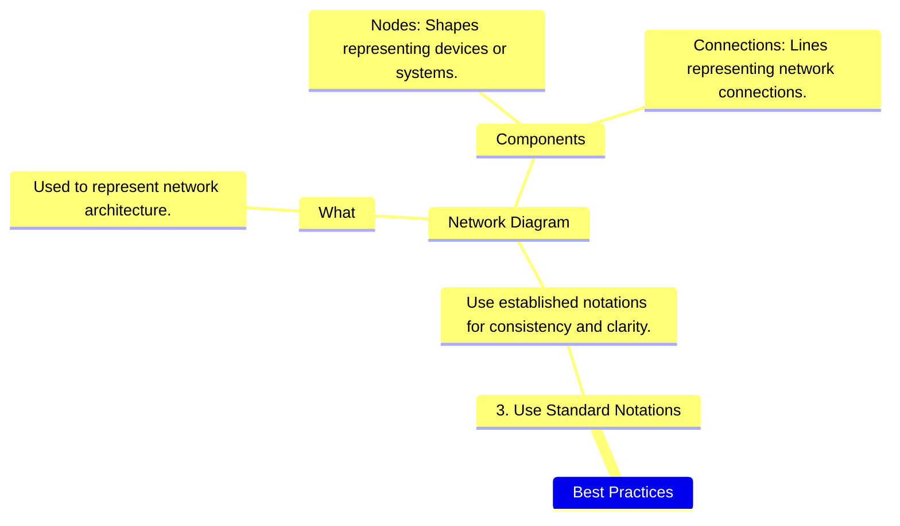

---
Tags:
  - THEME
---

# Best practices

- 

```mermaid
mindmap
    Best Practices
         3. Use Standard Notations
           Use established notations for consistency and clarity.
               Network Diagram
                  What
                     Used to represent network architecture.
                  Components  
                     Nodes: Shapes representing devices or systems.
                     Connections: Lines representing network connections.

```              