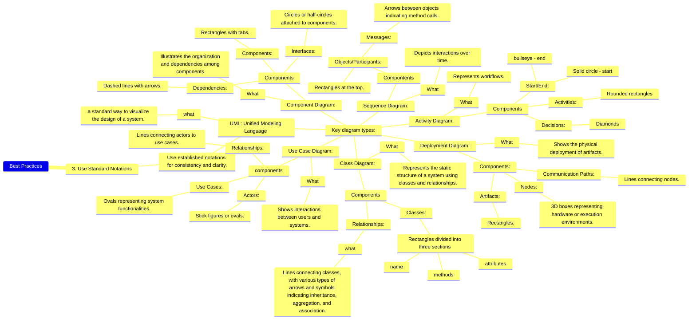

---
Tags:
  - THEME
---

# Best practices

- ![[IDEA-notation-uml]]
- 

```mermaid
mindmap
    Best Practices
         3. Use Standard Notations
           Use established notations for consistency and clarity.
               UML: Unified Modeling Language 
                  what
                     a standard way to visualize the design of a system. 
                  Key diagram types:
                     Class Diagram: 
                        What
                           Represents the static structure of a system using classes and relationships.
                        Components
                           Classes: 
                              Rectangles divided into three sections 
                                  name
                                  attributes
                                  methods
                           Relationships: 
                              what
                                 Lines connecting classes, with various types of arrows and symbols indicating inheritance, aggregation, and association.
                     Use Case Diagram: 
                        What
                            Shows interactions between users and systems.
                        components
                            Actors: 
                                Stick figures or ovals.
                            Use Cases: 
                                Ovals representing system functionalities.
                            Relationships: 
                                 Lines connecting actors to use cases.
                     Sequence Diagram: 
                        What
                            Depicts interactions over time.
                        Compontents
                            Objects/Participants: 
                                Rectangles at the top.
                             Messages: 
                                Arrows between objects indicating method calls.
                     Activity Diagram: 
                        What
                            Represents workflows.
                        Components
                            Activities: 
                                Rounded rectangles
                            Decisions: 
                                Diamonds
                            Start/End: 
                                Solid circle - start
                                bullseye - end
                     Component Diagram: 
                        What
                          Illustrates the organization and dependencies among components.
                        Components
                          Components: 
                             Rectangles with tabs.
                          Interfaces: 
                             Circles or half-circles attached to components.
                          Dependencies: 
                             Dashed lines with arrows.
                     Deployment Diagram: 
                        What
                          Shows the physical deployment of artifacts.
                        Components: 
                           Nodes: 
                              3D boxes representing hardware or execution environments.
                           Artifacts: 
                              Rectangles.
                           Communication Paths: 
                              Lines connecting nodes.
```              