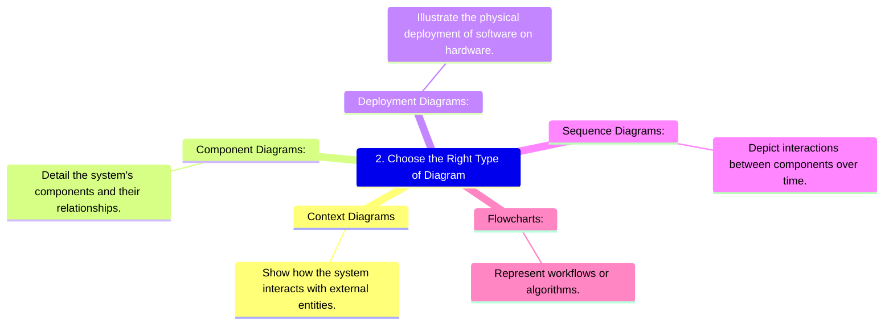

---
Tags:
  - THEME
---

# Best practices: Choose right Type of diagram

```mermaid
mindmap
        2. Choose the Right Type of Diagram
           Context Diagrams 
               Show how the system interacts with external entities.
           Component Diagrams: 
               Detail the system's components and their relationships.
           Deployment Diagrams: 
               Illustrate the physical deployment of software on hardware.
           Sequence Diagrams: 
               Depict interactions between components over time.
           Flowcharts: 
               Represent workflows or algorithms.
```              