---
Tags:
  - THEME
---

# Best practices

- ![[IDEA-notation-uml]]
- ![[IDEA-notation-SysML]]
- ![[IDEA-notation-network]]
- ![[IDEA-notation-gantt]]
- ![[IDEA-notation-flowchart]]
- ![[IDEA-notation-erd]]
- ![[IDEA-notation-dfd]]
- ![[IDEA-notation-bpm]]
- ![[IDEA-notation-ArchiMate]]
- ![[IDEA-notation-why]]
-

```mermaid
mindmap
    Best Practices
         3. Use Standard Notations
           Use established notations for consistency and clarity.
               UML: Unified Modeling Language 
                  what
                     a standard way to visualize the design of a system. 
                  Key diagram types:
                     Class Diagram: 
                        What
                           Represents the static structure of a system using classes and relationships.
                        Components
                           Classes: 
                              Rectangles divided into three sections 
                                  name
                                  attributes
                                  methods
                           Relationships: 
                              what
                                 Lines connecting classes, with various types of arrows and symbols indicating inheritance, aggregation, and association.
                     Use Case Diagram: 
                        What
                            Shows interactions between users and systems.
                        components
                            Actors: 
                                Stick figures or ovals.
                            Use Cases: 
                                Ovals representing system functionalities.
                            Relationships: 
                                 Lines connecting actors to use cases.
                     Sequence Diagram: 
                        What
                            Depicts interactions over time.
                        Compontents
                            Objects/Participants: 
                                Rectangles at the top.
                             Messages: 
                                Arrows between objects indicating method calls.
                     Activity Diagram: 
                        What
                            Represents workflows.
                        Components
                            Activities: 
                                Rounded rectangles
                            Decisions: 
                                Diamonds
                            Start/End: 
                                Solid circle - start
                                bullseye - end
                     Component Diagram: 
                        What
                          Illustrates the organization and dependencies among components.
                        Components
                          Components: 
                             Rectangles with tabs.
                          Interfaces: 
                             Circles or half-circles attached to components.
                          Dependencies: 
                             Dashed lines with arrows.
                     Deployment Diagram: 
                        What
                          Shows the physical deployment of artifacts.
                        Components: 
                           Nodes: 
                              3D boxes representing hardware or execution environments.
                           Artifacts: 
                              Rectangles.
                           Communication Paths: 
                              Lines connecting nodes.

               BPM: Business Process Model and Notation 
                  What
                     BPMN is used to model business processes in a workflow.
                  Components
                     Events: 
                        Circles 
                           Meaning
                              start
                              intermediate
                              end
                     Activities: 
                          Rounded rectangles
                     Gateways: 
                          Diamonds for decision points.
                     Flows: 
                          Arrows indicating the sequence of activities.
               ERD Entity-Relationship Diagram 
                  What
                    ERDs are used to model data relationships.
                  Components
                      Entities: 
                          Rectangles
                      Attributes: 
                          Ovals connected to entities
                      Relationships: 
                           Diamonds or lines connecting entities
               DFD Data Flow Diagram 
                  What
                     DFDs represent the flow of data within a system.
                  Components   
                     Processes: 
                         Circles or rounded rectangles
                     Data Stores: 
                         Open-ended rectangles
                     Data Flows: 
                         Arrows
                     External Entities: 
                         Squares or rectangles
               SysML Systems Modeling Language
                  What
                    SysML is used for systems engineering applications.
                  Components  
                    BDD Block Definition Diagram
                        Similar to UML class diagrams
                    IBD Internal Block Diagram 
                        Shows internal structure of a system or block.
                    Requirement Diagram
                        Defines and relates requirements.
                    Parametric Diagram
                        Represents constraints on system properties.
               ArchiMate
                  What
                    ArchiMate is a modeling language for enterprise architecture.
                  Components  
                    Layers: 
                       Business
                       application
                       technology layers
                    Elements: 
                        Boxes representing different entities 
                           Example 
                              business processes 
                              applications 
                              infrastructure
                    Relationships: 
                       Lines and arrows showing dependencies and interactions
               Flowchart
                  What
                     Flowcharts are used to represent algorithms or workflows.
                  Components  
                     Processes: 
                        Rectangles
                     Decisions: 
                         Diamonds
                     Start/End: 
                         Ovals or rounded rectangles
                     Flows: 
                       Arrows.
               Gantt Chart
                  What
                    Used for project scheduling.
                  Components  
                    Tasks: 
                       Horizontal bars representing duration
                    Milestones: 
                       Diamonds

               Network Diagram
                  What
                     Used to represent network architecture.
                  Components  
                     Nodes: Shapes representing devices or systems.
                     Connections: Lines representing network connections.
           Why
               Standardization / Consistency
                     symbols and shapes
               Represent various aspects of software architecture
               ensuring clarity 
               ensuring consistency in communication.
```              
