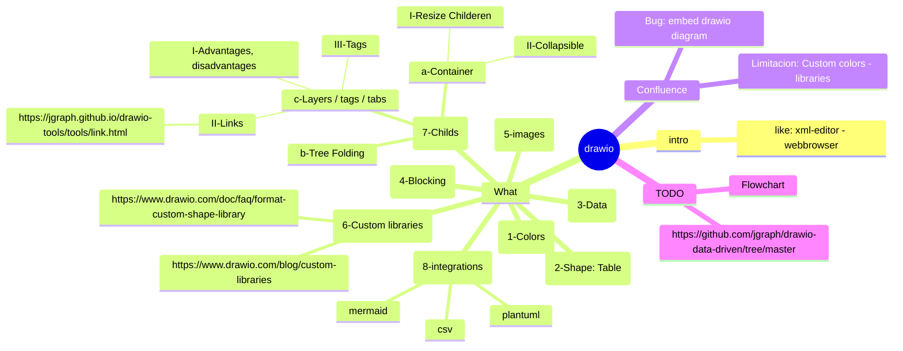

# Brainstorm



https://www.drawio.com/blog/configure-template-library

## Actions

```json
data:action/json,{"actions":[
     {"hide":{"tags":["BBDD-LEGACY"]}}
]}
```

```json
data:action/json,{"actions":[
     {"show":{"tags":["BBDD-LEGACY"]}}
]}
```


data:action/json,{"actions":[
     {"show":{"cells":["CDU-RECUPERAR-DATOS"]}}
    , {"show":{"cells":["CDU-CAMBIAR-DATOS"]}} 
]}


data:action/json,{"actions":[
     {"show":{"cells":["CDU-CAMBIAR-DATOS"]}}
     , {"hide":{"cells":["FLOW"]}}
]}


https://drawio-app.com/blog/interactive-diagrams-with-custom-links-and-actions/
https://www.drawio.com/blog/interactive-diagram-layers

https://blog.programster.org/interactive-diagrams-with-draw-io

- open a diagram page
- toggle, show, hide or highlight the specified shapes, layers or pages
- select the elements
- scroll to the first listed element.


flowAnimation=1;


```json
data:action/json,{"actions":[
        {
            "style": {
                "tags": [
                    "FLW-CREAR-PROVEEDOR"
                ],
                "key": "flowAnimation",
                "value": "1"
            }
        }
     ,  {
            "style": {
                "tags": [
                    "FLW-RECUPERAR-DATOS"
                    , "FLW-CAMBIAR-DATOS"
                    , "FLW-BORRAR-ALMACEN"
                ],
                "key": "flowAnimation",
                "value": "0"
            }
        }  
]}        
```


```json
data:action/json,{"actions":[
        {
            "style": {
                "tags": ["FLW-RECUPERAR-DATOS"],
                "key": "flowAnimation",
                "value": "0"
            }
        }, {
            "style": {
                "tags": ["FLW-CAMBIAR-DATOS"],
                "key": "flowAnimation",
                "value": "0"
            }
        },{
            "style": {
                "tags": ["FLW-BORRAR-ALMACEN"],
                "key": "flowAnimation",
                "value": "0"
            }
        },{
            "style": {
                "tags": ["FLW-CREAR-PROVEEDOR"],
                "key": "flowAnimation",
                "value": "0"
            }
        },        {
            "style": {
                "tags": ["FLW-RECUPERAR-DATOS","BUTTON"],
                "key": "fillColor",
                "value": "#C5CAE9"
            }
        }, {
            "style": {
                "tags": ["FLW-CAMBIAR-DATOS","BUTTON"],
                "key": "fillColor",
                "value": "#C5CAE9"
            }
        },{
            "style": {
                "tags": ["FLW-BORRAR-ALMACEN","BUTTON"],
                "key": "fillColor",
                "value": "#C5CAE9"
            }
        },{
            "style": {
                "tags": ["FLW-CREAR-PROVEEDOR","BUTTON"],
                "key": "fillColor",
                "value": "#C5CAE9"
            }
        }
]}        
```
fillColor=#7986CB;
C5CAE9 //default


```json
data:action/json,{"actions":[
        {
            "style": {
                "tags": ["FLW-RECUPERAR-DATOS"],
                "key": "flowAnimation",
                "value": "1"
            }
        }, {
            "style": {
                "tags": ["FLW-CAMBIAR-DATOS"],
                "key": "flowAnimation",
                "value": "0"
            }
        },{
            "style": {
                "tags": ["FLW-BORRAR-ALMACEN"],
                "key": "flowAnimation",
                "value": "0"
            }
        },{
            "style": {
                "tags": ["FLW-CREAR-PROVEEDOR"],
                "key": "flowAnimation",
                "value": "0"
            }
        },        {
            "style": {
                "tags": ["FLW-RECUPERAR-DATOS","BUTTON"],
                "key": "fillColor",
                "value": "#7986CB"
            }
        }, {
            "style": {
                "tags": ["FLW-CAMBIAR-DATOS","BUTTON"],
                "key": "fillColor",
                "value": "#C5CAE9"
            }
        },{
            "style": {
                "tags": ["FLW-BORRAR-ALMACEN","BUTTON"],
                "key": "fillColor",
                "value": "#C5CAE9"
            }
        },{
            "style": {
                "tags": ["FLW-CREAR-PROVEEDOR","BUTTON"],
                "key": "fillColor",
                "value": "#C5CAE9"
            }
        }
]}        
```


